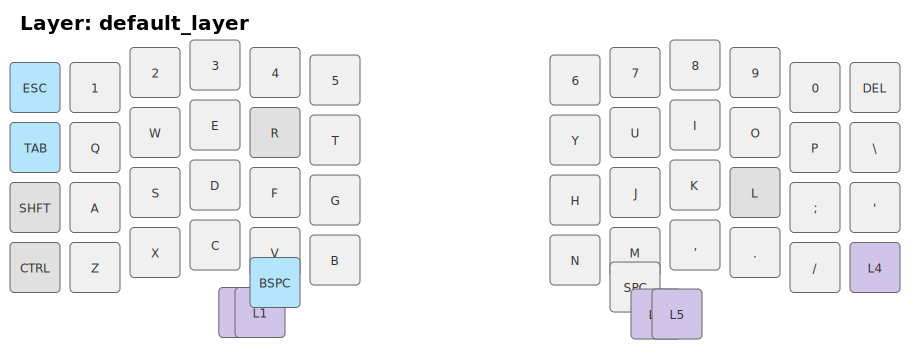
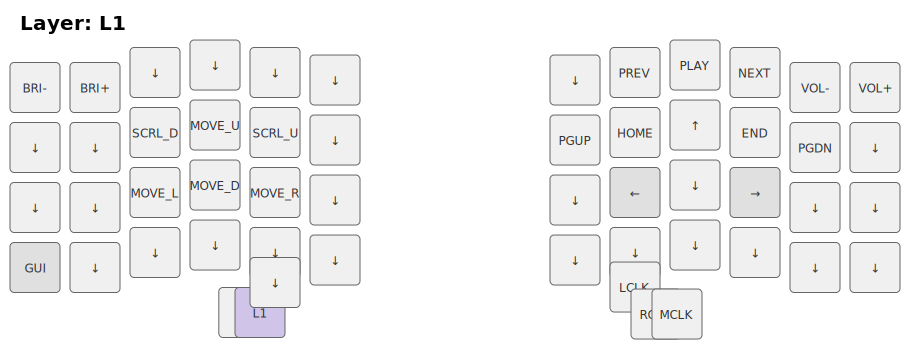
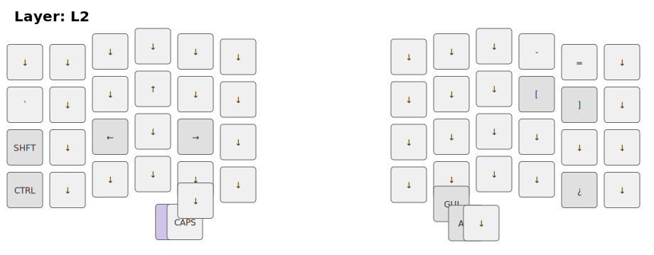
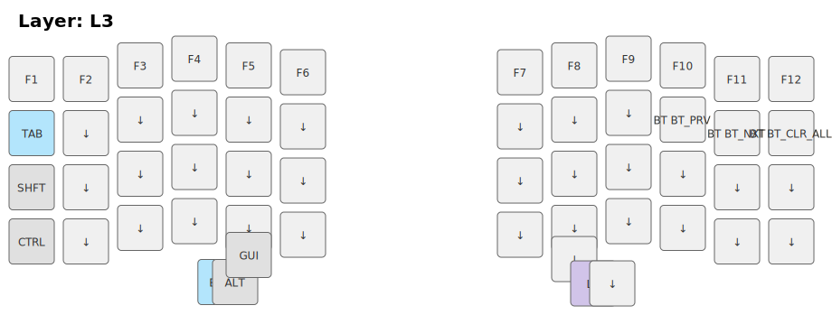
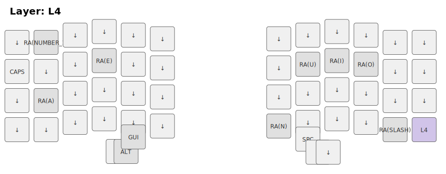
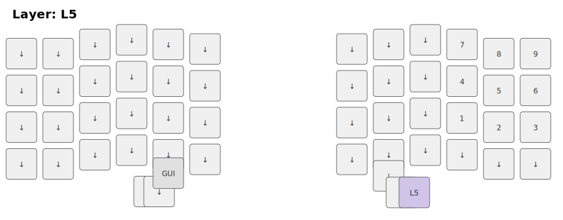

## Silakka54 — Todas las capas (keymap visual)

Aquí están los SVGs de todas las capas del teclado. Úsalos como referencia rápida.

### Default Layer (capa principal - QWERTY)

---

### L1 — Media / Functions

Acceso: mantén **MO1** (thumb izquierdo central)

Funciones multimedia, navegación, mouse, Bluetooth.

---

### L2 — Símbolos / Navegación

Acceso: mantén **MO2** (thumb izquierdo)

Símbolos, flechas de navegación, CAPSLOCK.

---

### L3 — F-Keys / Modificadores

Acceso: mantén **MO3** (thumb derecho central)

Teclas de función F1..F12, modificadores alternos.

---

### L4 — Capa alternativa

Acceso: mantén **MO4** (corner derecho en fila 4)

Mayormente transparente, con opciones extras.

---

### L5 — Numpad

Acceso: mantén **MO5** (thumb derecho)

Layout numpad (números 1-9 en la derecha).

---

### Cambios recientes

- **SPACE**: Movido al pulgar derecho (t1 en el thumb cluster) para comodidad con pulgar derecho.
- **BACKSPACE**: Movido al pulgar izquierdo (t3).

Para editar cualquier tecla, modifica `config/silakka54.keymap` y haz push. GitHub Actions recompilará automáticamente.
