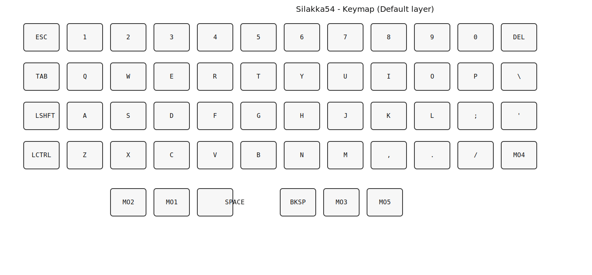

**Silakka54 — Visual keymap (Default layer)**

Abre `assets/silakka54_keymap.svg` para ver una representación visual del teclado. El SVG muestra la disposición física (4 filas + cluster de thumbs) con las etiquetas actuales de la capa `default`.

- Archivo SVG: `assets/silakka54_keymap.svg`
- Si quieres otra capa renderizada, dime cuál y la genero también.

Vista rápida:

Notas:
- Las teclas etiquetadas `MO1..MO5` son capas momentáneas: mantenlas para acceder a las capas respectivas.
- Para cambiar cualquier tecla, edita `config/silakka54.keymap`, haz commit y push; GitHub Actions recompilará automáticamente.
